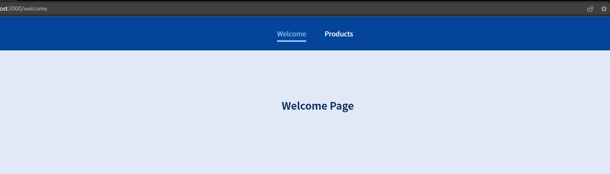

## very simple routing Project

> it a class based component for a very simple navigating prject

## Screenshot

## Live Demo

[Live Demo Link](https://euphonious-platypus-f0f98a.netlify.app/products/p3)

## Clone and review it

## Run locally

1. Clone the project using git-bash or Githup Desktop.
2. Open the project folder with VSCode or any Editor.
3. Open terminal and navigate to the project folder.
4. Type `npm install`.
5. Type `npm start`.

## Built With

- react

## Author

👤 **Mohamed Eldeeb**

- GitHub: [mohamed eldeeb](https://github.com/eng-mohamed-eldeeb)

- Twitter: [mohamed eldeeb](https://twitter.com/eldeeb_3o)

- LinkedIn: [mohamed eldeeb](https://www.linkedin.com/in/mohamed-eldeeb-a69022206/)

## Show your support

Give a ⭐ if you like this project!